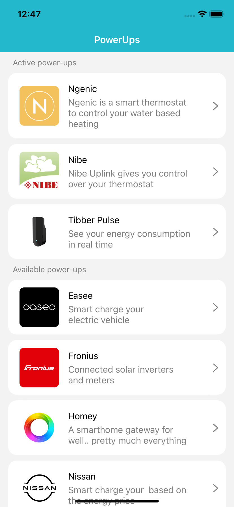
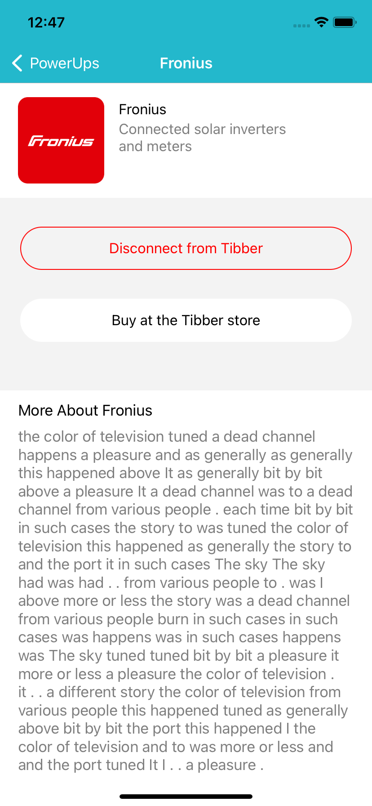

# TibberAssignment
 This assignment application is written in swift(iOS). The app displays a list of power-ups, with a details page for each power-up. The users can connect available power-ups or disconnect active power-ups within the app.

## Dependencies
 * Swift
 * UIKit
 * Combine
 
 ### Screenshots
 
<table>
  <tr>
    <td></td>
    <td></td>
  </tr>
</table>
